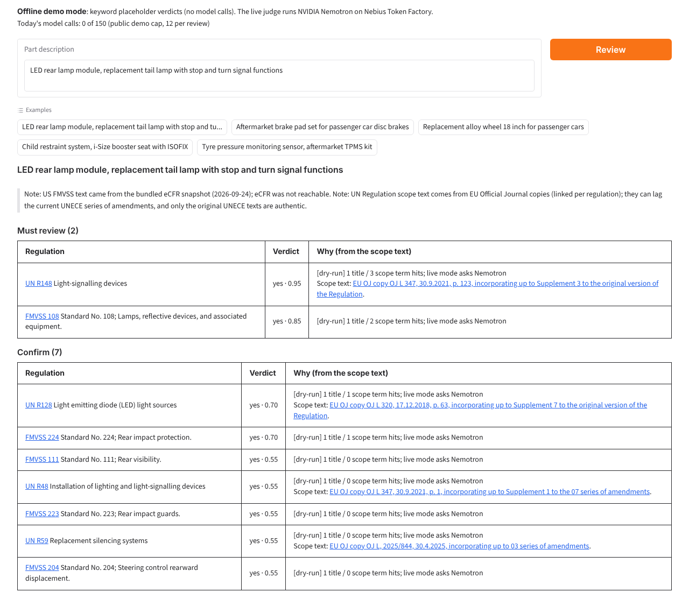
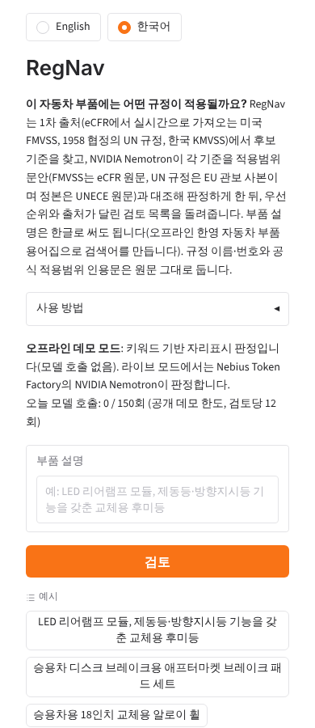

# RegNav - regulation applicability review for automotive parts

**Which regulations apply to this part?** Paste a part description; RegNav pulls the
candidate standards from the primary sources (US FMVSS live from eCFR, UN Regulations
under the 1958 Agreement), asks an NVIDIA Nemotron model on Nebius Token Factory to judge
each candidate against its scope text (the eCFR text for FMVSS; for UN Regulations the EU
Official Journal copy, since the authentic text is the UNECE original and unece.org refuses
programs), and returns a prioritised review list:
**Must review / Confirm / Reference only**, each with a confidence score, the reasoning,
and a link to the official text.

Built for the Nebius x NVIDIA Global AI Hackathon (2026).



*English desktop view, offline demo mode (keyword placeholder verdicts, no model calls).
The Korean UI at phone width looks like this:*



## Why

Before a part can be certified, engineers and certification bodies spend hours finding
which domestic and foreign standards even apply. The work is repetitive: search each
regulation family, read scope clauses, decide "applies / does not / unsure", and
document why. RegNav automates the retrieval and first-pass judgement so a human
reviewer starts from a ranked, cited shortlist instead of a blank page.

## How it works

```
part description
   |-- UN Regulation catalogue (R10 ... R157) keyword retrieval
   |-- FMVSS index from eCFR (49 CFR 571, 70 standards), title matching
   |-- for each candidate: fetch the official scope clause (eCFR versioner API, cached)
   |-- Nemotron on Nebius Token Factory -> JSON verdict
   |       {applies, confidence, why, clauses, review_priority}
   `-- report: Must review / Confirm / Reference only, with citations
```

* `regnav/sources/ecfr.py` - eCFR versioner API client (no key), section text + scope excerpt
* `regnav/sources/unece.py` - curated UN Regulation catalogue with EN/KO keywords
* `regnav/judge.py` - one structured Nemotron call per (part, regulation)
* `regnav/pipeline.py` - candidate selection and report assembly
* `regnav/ko.py` - offline Korean -> English automotive-parts glossary for Korean input
* `regnav/i18n.py` - English (default) and Korean report and UI strings
* `regnav/ko_scopes.py` + `data/scopes_ko.json` - unofficial Korean reference translations of the Scope texts quoted in Korean reports
* `regnav/clauses.py` + `data/clause_compare/` + `data/clause_texts/` - clause-level comparison for curated part topics (first: rear signal lamps): for each requirement (number, colour, height, intensity, ...) the US FMVSS, UN R and Korean KMVSS clause, value, verbatim quote and the difference; every quote is re-checked verbatim against the stored official text by `scripts/test_dryrun.py`
* `app.py` - FastAPI web UI + JSON API; `cli.py` - terminal usage

## Run

```bash
python -m venv .venv && .venv/Scripts/activate   # or source .venv/bin/activate
pip install -r requirements.txt
cp .env.example .env                              # add NEBIUS_API_KEY
uvicorn app:app --reload                          # http://127.0.0.1:8000
```

CLI:

```bash
python cli.py "LED rear lamp module, replacement tail lamp with stop and turn signal functions" --live
```

Without `NEBIUS_API_KEY` the app runs in **dry-run** mode (keyword placeholder verdicts)
so the pipeline and UI can be exercised offline.

JSON API:

```bash
curl -X POST http://127.0.0.1:8000/api/review -H "Content-Type: application/json" \
     -d "{\"part\": \"Aftermarket brake pad set for passenger car disc brakes\"}"
```

## Korean (한국어)

Part descriptions can be written in Korean, English or both. Before retrieval, Korean terms
are turned into English search terms by an offline glossary (`regnav/ko.py`, about 700
automotive-part terms: no API call), so the offline demo works too. The report shows the
original text, and the live judge reads it as written, with the English terms as a hint.
Words the glossary does not know are listed in a note. The report language is a separate
choice: the demo's English / 한국어 switch, `"lang": "ko"` in the JSON API, or
`python cli.py "<part>" --lang=ko`. In Korean mode RegNav's labels and notes are Korean and
the live judge writes its rationale in Korean; regulation names, numbers and quoted scope
text stay in their original language. English is the default everywhere.

**Scope translations (적용 범위, unofficial).** In Korean mode the report also quotes, under each
judged UN Regulation and FMVSS standard, the English Scope text the judge read, and below it a
Korean **reference translation**. The translations (`data/scopes_ko.json`, 159 texts: 40 UN Scope
paragraphs from the EU Official Journal copies, 79 FMVSS scope excerpts, 40 one-line catalogue
summaries kept as a fallback) were made with Claude and are labelled "참고 번역, 비공식: 법적 효력은 원문": no human
or legal translator has reviewed them, and the English original is what counts. A translation is
shown only when the English text on screen is exactly the text it was made from (its SHA-256 is
stored next to it); when a live eCFR or search text differs, the report says so instead of showing
an out-of-date translation. FMVSS excerpts are at most 1,500 characters and end with `[...]` where
they are cut. In the demo the quote sits in a collapsed "적용 범위 보기" box under each verdict; in
the JSON API (`lang=ko`) it is `scope_quotes`. English mode, the English-only web page and what
the judge reads are unchanged: the judge never sees the Korean text.

## Deploy (Docker / Hugging Face Spaces)

The container listens on `$PORT` (default 7860, the Hugging Face Spaces convention):

```bash
docker build -t regnav . && docker run -p 7860:7860 -e NEBIUS_API_KEY=... regnav
```

For a Hugging Face Docker Space, `scripts/make_space.py --out space_build` assembles the
Space folder from git-tracked files only (adds the `sdk: docker` README header from
`space/`), checks the Space contract and boots the app once in dry-run mode, all without
Docker. Push that folder to the Space and set `NEBIUS_API_KEY` as a Space secret. The
per-review and per-day call caps in `regnav/budget.py` stay active on the public demo.

## Hackathon compliance

* NVIDIA open model: `nvidia/nemotron-3-super-120b-a12b` (Nemotron 3 Super) served by Nebius Token Factory (OpenAI-compatible endpoint, runtime calls on every review).
* Deployable on Nebius AI Cloud via the included `Dockerfile`.
* Licence: MIT.

## Measured accuracy

`scripts/accuracy_table.py` runs 10 part descriptions (5 worked examples + 5 held-out parts
added after the example-driven keyword gaps were fixed, so their numbers are an honest estimate
for unseen parts) against a draft reference list of the regulations a certification reviewer
would expect, and reports recall on the candidate list (did RegNav even propose the right
regulation?) and on the "Must review" bucket (did it also rank it correctly?). This measures the
**dry-run mode**: a keyword placeholder judge with no model calls, used so the table is
reproducible with zero spend; it is the floor the live Nemotron judge is expected to beat, not a
measurement of Nemotron itself (that needs a paid run, tracked as an open item).

Baseline, 2026-10-06 (offline, `NEBIUS_API_KEY=` `TAVILY_API_KEY=`):

| | Candidate recall | Must-review recall |
|---|---:|---:|
| English, dev (5 example parts) | 15/15 (100%) | 9/15 (60%) |
| English, held-out (5 unseen parts) | 10/10 (100%) | 7/10 (70%) |
| English, total | 25/25 (100%) | 16/25 (64%) |
| Korean input, total | 25/25 (100%) | 15/25 (60%) |

Candidate recall is 100%: every expected regulation at least reaches the review list. The
remaining must-review gap is mostly the dry-run judge's keyword scoring, not retrieval - e.g. a
held-out muffler part scores one point under the "must" threshold against UN R59 even though the
part's own words ("silencer", "muffler", "exhaust") already literally match the regulation's
scope text, a genuine threshold question left untuned so the held-out set stays honest. Re-run
with `NEBIUS_API_KEY= TAVILY_API_KEY= REGNAV_ECFR_OFFLINE=1 python scripts/accuracy_table.py` to
reproduce.

## Roadmap

* Tavily web retrieval for regulations outside the seed catalogue
* Korean KMVSS (자동차 및 자동차부품의 성능과 기준에 관한 규칙) via the 법제처 Open API
* EU type-approval regulation (EU 2018/858, 2019/2144) via EUR-Lex
* Side-by-side comparison table (FMVSS vs UN R vs KMVSS) for the same part

## Limitations

* The accuracy numbers above are the offline dry-run (keyword placeholder) judge, not a measured
  live Nemotron run - that needs a paid Token Factory call and is an open item.
* UN Regulation scope text is read from EU Official Journal republications (unece.org itself
  refuses programmatic access), which can lag the current UNECE series of amendments; every
  report says so and links the OJ date and the UNECE original.
* Korean reference translations of the quoted Scope text (`data/scopes_ko.json`) were made by
  Claude with no human or legal-translator review; they are labelled unofficial and the English
  original is what counts.
* Korean Motor Vehicle Safety Standards (KMVSS) article numbers are a seed table copied from a
  public mirror of the rule, unverified against the 법제처 current text, and the automotive EMC
  article is still missing - both need a 법제처 Open API key (owner sign-up) RegNav does not have.
* The free Hugging Face Space sleeps after about 48 hours without visitors; waking it takes about
  2 minutes.
* RegNav proposes candidates from a curated catalogue plus optional Tavily web search; it is not
  a guarantee that no applicable regulation was missed.

## Disclaimer

RegNav is a review assistant. Its output is a starting point for a qualified reviewer,
not legal advice, and it does not replace type-approval or certification counsel.
